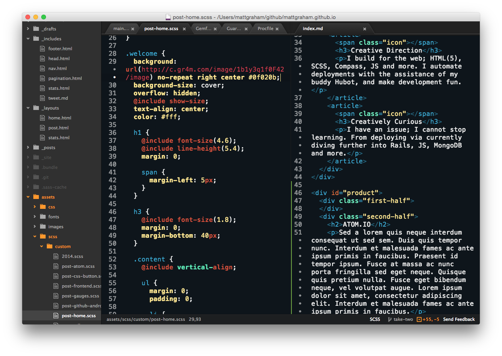
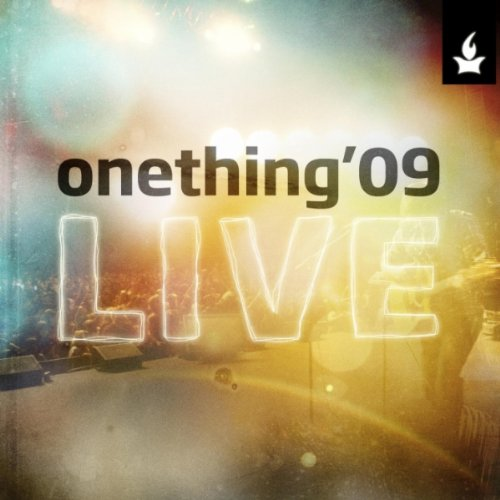

  

    <h1 id="fittext1" class="mv2">Matt Graham</h1>
    

    
Lead UX design and frontend development at Salesforce

    <ul class="pa0 ma0 mv5">
      <li class="twitter"><a href="http://twitter.com/mattgraham"></a></li>
      <li class="github"><a href="http://github.com/mattgraham"></a></li>
      <li class="dribbble"><a href="http://dribbble.com/mattgraham"></a></li>
    </ul>
  

<!-- end welcome -->

  

  
Building applications that cause change.

  

    
Professionally, I'm a <strong>Lead UX Designer and frontend developer</strong> designing applications on the <a href='http://heroku.com' target='_blank'>Heroku</a> platform at <a href='http://salesforce.com' target='_blank'>Salesforce</a>, by way of remote life in Port Huron, MI. Previously I've worked at <a href="http://github.com" target="_blank">GitHub</a>, <a href="https://github.com/blog/993-ordered-list-is-a-githubber" target="_blank">Ordered List</a> and other small design and development firms. I love simple, beautiful apps that change the way we live and do things. I focus on what it takes to make simple web applications, successful experiences, while automating all that I can.

    
Personally, I'm a <strong>Search and Recovery diver</strong> for the St. Clair County Sheriff Department, <strong>Chairperson</strong> for the Dive Team Auxiliary, <strong>husband</strong> to Shannon and <strong>father</strong> to our beautiful daughter.

    
If you have questions, please don't hesitate to reach out and say hello via twitter at <a href="http://twitter.com/mattgraham" target="_blank">@mattgraham</a>.
    

  

  

  

    

      

      

        
$ sf

        
The Salesforce CLI

         

        
VERSION

        
@salesforce/cli/1.0.1 darwin-x64 node-v12.15.0

         
        
$ sf org create -n MyOrg

         

        
What kind of environment do you want to create?

        
        <table class="mb4">
          <tr>
            <td class="">➡ </td>
            <td class="ph1">Scratch Org</td>
          </tr>
          <tr>
            <td class=""></td>
            <td class="ph1">Sandbox Org</td>
          </tr>
        </table>

        
Choose a Dev Hub to use to create your Scratch Org

        
        <table class="mb2">
          <tr>
            <td class="">➡ </td>
            <td class="ph1">DevHub1 (mydevhublogin@org.salesforce.com)</td>
          </tr>
          <tr>
            <td class=""></td>
            <td class="ph1">Log in to another Dev Hub</td>
          </tr>
          <tr>
            <td class=""></td>
            <td class="ph1">Compute Org</td>
          </tr>
        </table>
      

    

    

      

      
      

        

          

          
          

        

        
One of the most difficult leaps in my design career has been designing for the future Salesforce Unified CLI. <strong>sf</strong> is a new cli (built on top of OCLIF, which I was also able to help with designning years ago) with the primary goal of unifing all the salesforce brands and future features in a brand new CLI.

      

      

    

  

  

    

      

      

        

          

          
          

          
          

        

        I've completed my fourth year with Heroku / Salesforce now as a lead product designer. I've designed and seen launched the first ever Heroku Elements Marketplace (including the internal partner portal), worked in many areas of the Heroku Dashboard, contributed to the Purple Design System among other things.
      

      

    

    

      

        

          
          
Heroku Postgres

          
Reliable and powerful database as a service based on PostgreSQL.

        

        

          
          
Heroku Connect

          
Salesforce Data Synchronization Service on the Heroku platform.

        

        

          
          
Heroku Scheduler

          
Run scheduled tasks every 10 minutes, every hour, or every day. 

        

        

          

            

            <ul class="pa0 ma0 white lh-copy">
              <li class="b">6 Regions</li>
              <li class="b">App Sharable</li>
              <li class="b">Multiple Installs</li>
              <li class="b"></li>
              <li class="normal">Plans starting at</li>
              <li class="b">$100 Mo.</li>
            </ul>
            

            

              
View Details

            

          

          
          
Heroku Kafka

          
Reliable and powerful Apache Kafka as a service on the Heroku platform.

        

      

    

  

  

  

    
  

  

    
      
Atom is an open source text editor built as a desktop application based on web technologies. It has all your native menus and dialogs, and full access to the file system. What makes it different than say Sublime then? The power of the opensource community.

      
At GitHub I was part of the team who took Atom from a neat idea to a completely open source application that the market is now running with. I helped design and develop base UI and syntax themes, UX experience, marketing materials, among other elements.

  

  

  

  

    
      

        <h3>Onething Live</h3>
        <h4 class="db sans mv2">Forerunner Music</h4>
        <ol class="db sans mv4">
          <li>Lowest Place</li>
          <li>You Made a Way</li>
          <li>I Put On Christ</li>
          <li>Psalm of Abraham</li>
          <li>Where I Belong</li>
          <li>My Beloved</li>
          <li>People Get Ready</li>
          <li>Forevermore</li>
          <li>Real Love</li>
          <li>Grace to Love You</li>
          <li>Reason to Dance</li>
          <li>Whom the Son Sets Free</li>
          <li>No One Else</li>
        </ol>
      

  

  

    
    
Play was how we did music at GitHub. As taken from the readme, "Play is an employee-powered iTunes-based client-driven distributed music server for your office. Also it can prepare your taxes." I never got it to do my taxes, however being able to queue up music across the world and stream along side your remote co-workers; that was done well. Play was a Rails app originally built off iTunes DJ and later moved to MPD

    
I worked on designing iOS and Android apps, web interface, wrote markup and styles for the web app and even did a <a href="https://speakerdeck.com/mattgraham/github-play" target="_blank">little speaking</a> on Play. Additional design elements can be found on <a href="https://dribbble.com/mattgraham/projects/212617-Play" target="_blank">dribbble</a>.

  

  

  

  

    
  

  

    
    
Create, manage, and discuss issues and stay up to date with an integrated news feed for all your organizations, friends, and repositories. View your issues dashboard to stay connected with all the issues you've reported, been assigned, or participating in the discussion on. You can also view and filter a repository's issue list and bookmark it for quick access.

    
GitHub for android still to this day holds a 4.4/5 Star rating and over 450,000 downloads in the <a href="https://play.google.com/store/apps/details?id=com.github.mobile&hl=en" target="_blank">Google Play store</a>. I was the lone designer that worked alongside two developers to build and then opensource GitHub for Android.

    

  

  

  
Personal thoughts

  

  
      <li class="">
        <a href="{{ post.url }}">
          
          
{{ post.title }}

        </a>
      </li>
  
  

  

    <a href="/articles.html">view all articles</a>
  

